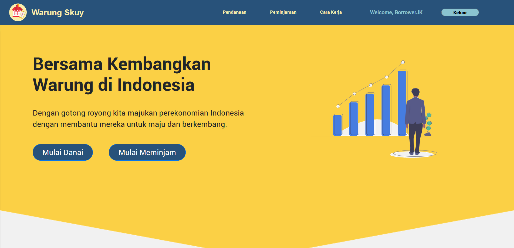
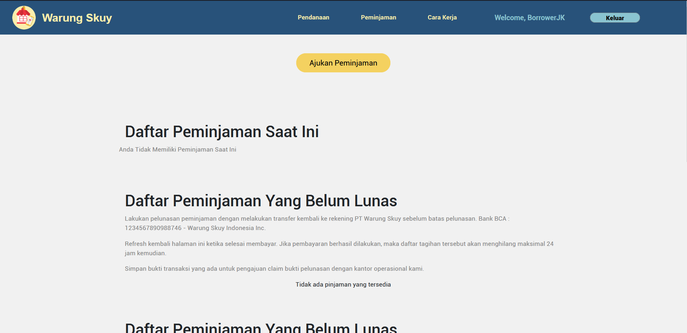
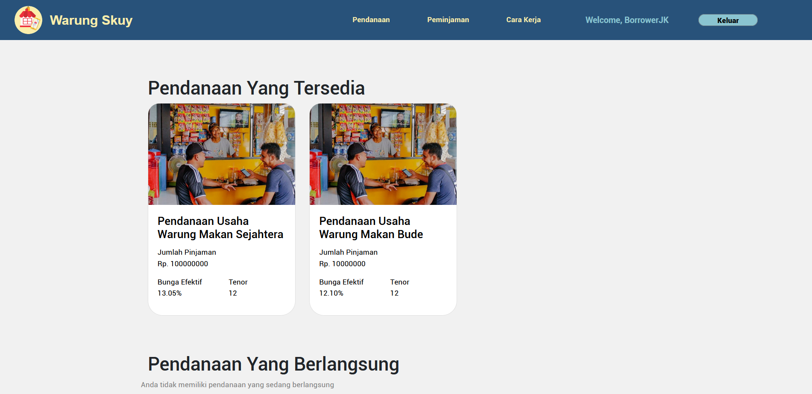
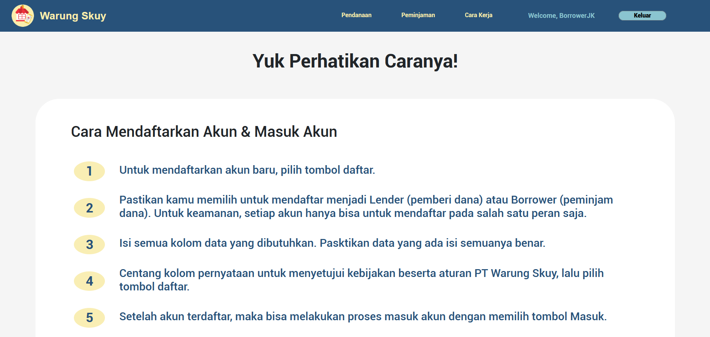

# Warung Skuy
A website platform for lending and borrowing focused for warung. The project is developed using Flask for its backend and HTML CSS for its frontend.

Created By :

* Jonathan Kristanto 

* Raymond Tiandinatan

* Ariel Waraney Manueke


## Preview





## How to run the projects
- Make sure to clone the project first.

- After cloning, activate the virtual environtment with the command 
Windows : ```env\Scripts\activate```
Mac : ```source env\Scripts\activate```

- Make sure to satisfy packages in requirements.txt. You can do that by running ```pip install -r requirements.txt"``` 

- You can now run the project using ```python run.py```

- Open the project via the localhost http://127.0.0.1:5000/ 

- To deactivate environtment you can use the command ```deactivate```

## Setting DB
#### Notes : You only need to do this when there're update to the DB model. No need to run this everytime you want to start the project
- Open python terminal ```python```

- Import db instance ```from warungskuy import db```

- Create the db ```db.create_all()```

To inspect the DB you can install DB Browser (SQLite) from https://sqlitebrowser.org/ 


## Updating DB

- Open ```python```

- Run command :
    1. ```from warungskuy import db```
    2. ```db.drop_all()```
    3. ```db.create_all()```

- If there are more updates to the table, quit python and rerun all the command above

Copyright (C) 2021 